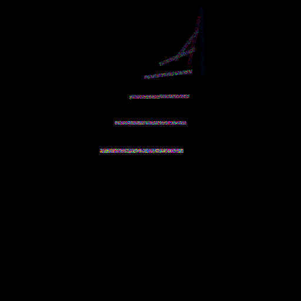

# bar-noise

A small animation of a moving bar with hue noise used as fill colour.



## How to build and run

Build:

- With nix:
  ```
  nix-shell
  cabal configure
  cabal build
  ```

- With cabal:
  ```
  cabal configure
  cabal install --dependencies-only
  cabal build
  ```

Run:

```
cabal run
```

## Options

```
➜ cabal run -- --help
Preprocessing executable 'bar-noise' for bar-noise-0.1.0.0..
Building executable 'bar-noise' for bar-noise-0.1.0.0..
Running bar-noise...
bar-noise - moving bar, hue noise

Usage: bar-noise [-o|--output FILENAME] [--width WIDTH] [--height HEIGHT]
                 [-d|--duration SEC] [-f|--fps ARG] [-t|--thickness ARG]
                 [-s|--steps ARG]
  Make an animated GIF

Available options:
  -h,--help                Show this help text
```

## License

[MIT License](LICENSE)
Copyright (c) 2017 Basile Henry
